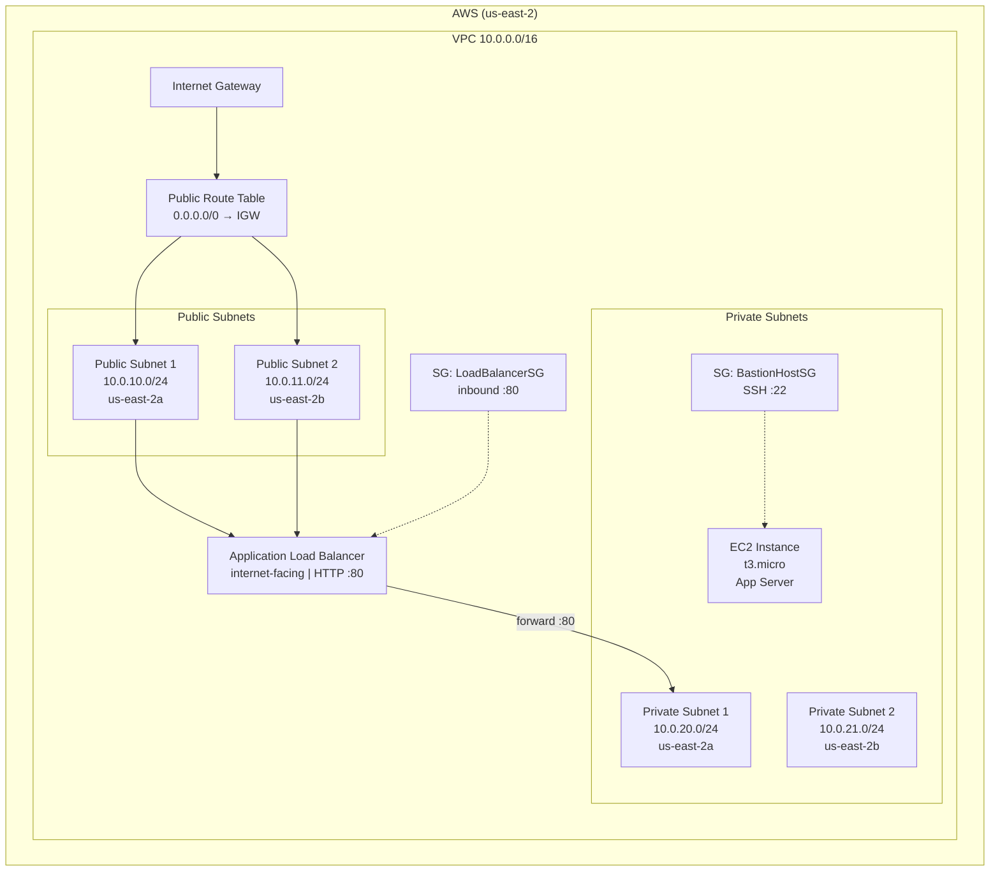
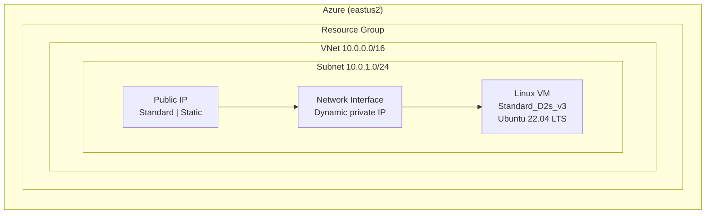
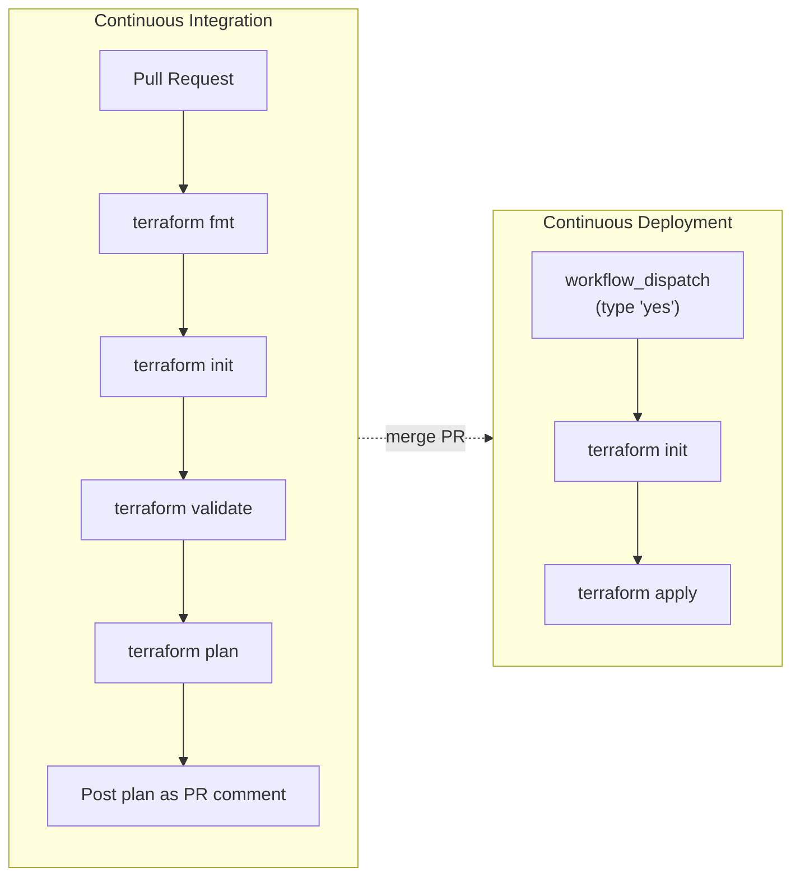

# iac-multi-cloud-aws-azure

Multi-cloud infrastructure as code using Terraform, provisioning resources on both **AWS** and **Azure** with automated CI/CD pipelines via GitHub Actions.

## Architecture

### AWS



### Azure



### CI/CD Pipeline



## Prerequisites

- [Terraform](https://developer.hashicorp.com/terraform/downloads) `>= 1.15.0`
- [AWS CLI](https://aws.amazon.com/cli/) (for local authentication)
- [Azure CLI](https://learn.microsoft.com/en-us/cli/azure/install-azure-cli) (for local authentication)
- **GitHub repository** with the following secrets configured (see below)

### Docker (alternative)

A pre-built Docker image with Terraform, AWS CLI, and Azure CLI is available. Build it locally:

```bash
docker build -t iac-multi-cloud-aws-azure .
```

## Project Structure

```
.
├── .github/
│   └── workflows/
│       ├── terraform-ci.yml    # CI: fmt, validate, plan on PR
│       └── terraform-cd.yml    # CD: manual apply via workflow_dispatch
├── IaC/
│   ├── providers.tf            # Terraform version + AWS & Azure providers
│   ├── variables.tf            # Input variables
│   ├── aws.tf                  # AWS resources (VPC, ALB, EC2, SGs)
│   ├── azure.tf                # Azure resources (RG, VNet, VM)
│   ├── outputs.tf              # Useful output values
│   └── backend.tf              # Remote S3 state for CI/CD
├── Dockerfile                  # Custom Docker image
└── .gitignore
```

## CI/CD Pipeline

### Continuous Integration (`terraform-ci.yml`)

Triggered on **pull requests** to `main`:

1. `terraform fmt -check` — enforce code style
2. `terraform init` — initialize providers and backend
3. `terraform validate` — validate configuration syntax
4. `terraform plan` — show execution plan, posted as a PR comment

### Continuous Deployment (`terraform-cd.yml`)

Triggered manually via **workflow_dispatch** (type `yes` to confirm):

1. `terraform init`
2. `terraform apply -auto-approve`

Both pipelines authenticate to the cloud providers using **OIDC**, no long-lived credentials stored anywhere.

## Required GitHub Secrets

| Secret | Description |
|--------|-------------|
| `AZURE_CLIENT_ID` | Azure App Registration client ID |
| `AZURE_TENANT_ID` | Azure tenant ID |
| `AZURE_SUBSCRIPTION_ID` | Azure subscription ID |

### AWS

AWS authentication uses a pre-configured IAM role (`github-actions-terraform-role`) with OIDC trust. The role ARN is hardcoded in the workflow files. Ensure the IAM role has the following trust policy:

```json
{
  "Effect": "Allow",
  "Principal": {
    "Federated": "arn:aws:iam::463032375612:oidc-provider/token.actions.githubusercontent.com"
  },
  "Action": "sts:AssumeRoleWithWebIdentity",
  "Condition": {
    "StringLike": {
      "token.actions.githubusercontent.com:sub": "repo:parquetpirate/*:ref:refs/heads/main"
    }
  }
}
```

### Azure

1. Create an App Registration:
   ```bash
   appId=$(az ad app create --display-name "github-actions-terraform" --query appId -o tsv)
   az ad sp create --id $appId
   az role assignment create --assignee $appId --role Contributor \
     --scope /subscriptions/YOUR_SUBSCRIPTION_ID
   ```

2. Add a federated credential:
   ```bash
   az ad app federated-credential create --id $appId --parameters '{
     "name": "github-actions-all-repos",
     "issuer": "https://token.actions.githubusercontent.com",
     "subject": "repo:parquetpirate/*:ref:refs/heads/main",
     "audiences": ["api://AzureADTokenExchange"]
   }'
   ```

3. Add the App Registration `appId`, your tenant ID, and subscription ID as GitHub secrets.

## Local Usage

### Authenticate

```bash
# AWS
aws configure
# or
export AWS_ACCESS_KEY_ID=...
export AWS_SECRET_ACCESS_KEY=...

# Azure
az login
```

### Deploy

```bash
cd IaC
terraform init
terraform plan
terraform apply
```

### Destroy

```bash
terraform destroy
```

## Outputs

| Output | Description |
|--------|-------------|
| `alb_dns_name` | AWS ALB DNS name |
| `ec2_private_ip` | EC2 instance private IP |
| `vpc_id` | AWS VPC ID |
| `az_resource_group_name` | Azure Resource Group name |
| `az_vm_public_ip` | Azure VM public IP |
| `az_vm_private_ip` | Azure VM private IP |

## Resources Created

### AWS
- VPC with public and private subnets across 2 availability zones
- Internet Gateway and route tables
- Application Load Balancer (internet-facing, HTTP)
- EC2 instance (`t3.micro`) in a private subnet
- Security groups for SSH and HTTP access

### Azure
- Resource Group
- Virtual Network with one subnet
- Public IP (Standard SKU, Static)
- Network Interface
- Linux Virtual Machine (`Standard_D2s_v3`, Ubuntu 22.04 LTS)
