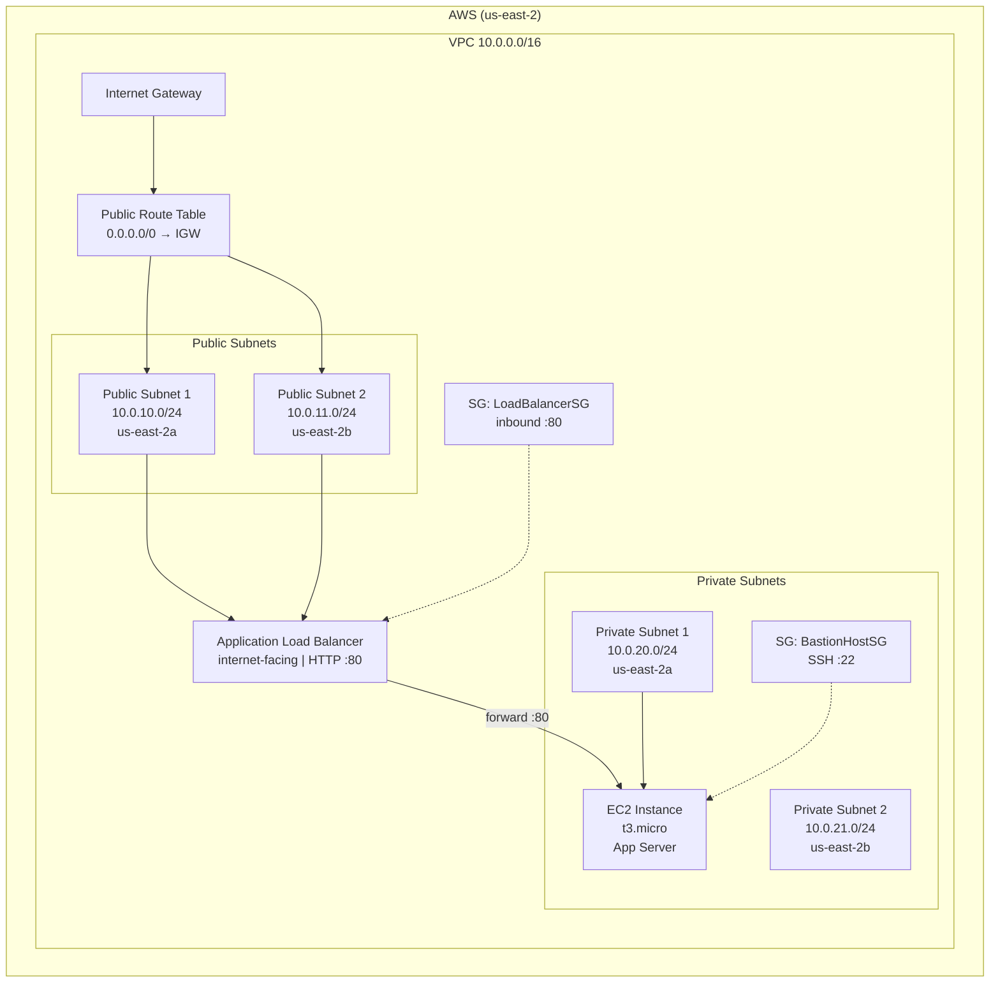
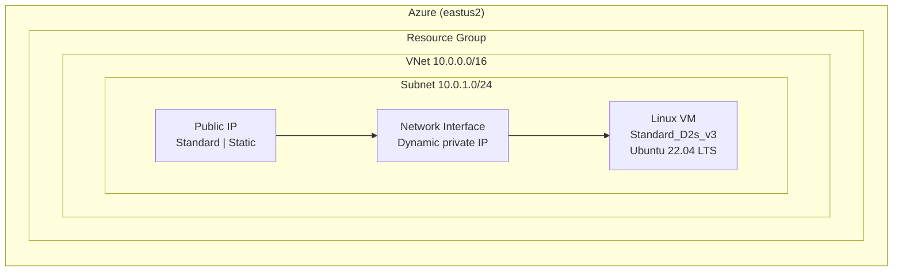
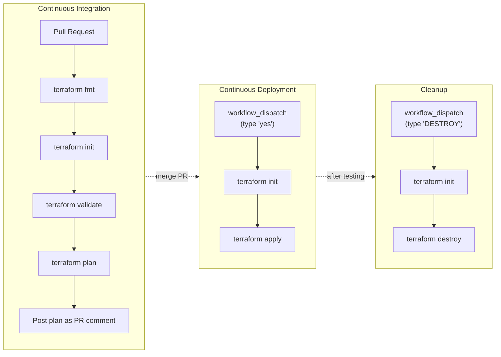

# iac-multi-cloud-aws-azure

[](https://developer.hashicorp.com/terraform/downloads)
[](https://registry.terraform.io/providers/hashicorp/aws/latest)
[](https://registry.terraform.io/providers/hashicorp/azurerm/latest)
[](https://github.com/parquetpirate/iac-multi-cloud-aws-azure/actions)

Multi-cloud infrastructure as code provisioning networking and compute resources on **AWS** and **Azure** simultaneously. Fully automated CI/CD pipeline with OIDC-based authentication — no long-lived credentials stored anywhere.

## Overview

This project demonstrates how to manage infrastructure across two major cloud providers from a single Terraform codebase. It provisions a production-style AWS application stack (VPC, load balancer, EC2) alongside an Azure Linux virtual machine, all orchestrated through GitHub Actions.

**Problem solved:** Eliminate manual cloud resource provisioning and credential management. Every change goes through pull request review with automated plan output, then one-click deployment to both clouds.

## Architecture

### AWS



### Azure



### CI/CD Pipeline



## Project Structure

```
.
├── .github/
│   └── workflows/
│       ├── docker-publish.yml       # Build & push Docker image to ghcr.io
│       ├── terraform-ci.yml         # CI: fmt, init, validate, plan on PR
│       ├── terraform-cd.yml         # CD: manual apply via workflow_dispatch
│       └── terraform-destroy.yml    # Manual destroy via workflow_dispatch
├── IaC/
│   ├── providers.tf                 # Terraform ≥1.15 + AWS & Azure providers
│   ├── variables.tf                 # Input variables
│   ├── aws.tf                       # AWS resources (VPC, ALB, EC2, SGs)
│   ├── azure.tf                     # Azure resources (RG, VNet, VM)
│   ├── outputs.tf                   # ALB DNS, VM IPs, VPC/RG IDs
│   └── backend.tf                   # Remote S3 state for CI/CD persistence
├── Dockerfile                       # Terraform + AWS CLI + Azure CLI image
├── .gitignore
└── README.md
```

## Infrastructure Components

### AWS — Application Stack

| Component | Resource | Configuration |
|-----------|----------|---------------|
| **VPC** | `aws_vpc` | CIDR `10.0.0.0/16`, tagged with deployment prefix |
| **Public Subnets** | `aws_subnet` ×2 | `10.0.10.0/24` (us-east-2a), `10.0.11.0/24` (us-east-2b) |
| **Private Subnets** | `aws_subnet` ×2 | `10.0.20.0/24` (us-east-2a), `10.0.21.0/24` (us-east-2b) |
| **Internet Gateway** | `aws_internet_gateway` | Attached to VPC, provides outbound internet |
| **Route Table** | `aws_route_table` | `0.0.0.0/0` → IGW, associated with public subnets |
| **ALB** | `aws_lb` | Internet-facing, application type, HTTP listener on port 80 |
| **Target Group** | `aws_lb_target_group` | HTTP, port 80, forwarding to EC2 |
| **EC2 Instance** | `aws_instance` | `t3.micro`, Amazon Linux 2, deployed in private subnet 1 |
| **Security Groups** | `aws_security_group` ×2 | BastionHostSG (SSH:22), LoadBalancerSG (HTTP:80) |

### Azure — Virtual Machine

| Component | Resource | Configuration |
|-----------|----------|---------------|
| **Resource Group** | `azurerm_resource_group` | Located in eastus2 |
| **Virtual Network** | `azurerm_virtual_network` | Address space `10.0.0.0/16` |
| **Subnet** | `azurerm_subnet` | `10.0.1.0/24` |
| **Public IP** | `azurerm_public_ip` | Standard SKU, Static allocation |
| **Network Interface** | `azurerm_network_interface` | Dynamic private IP, attached to public IP |
| **Linux VM** | `azurerm_linux_virtual_machine` | `Standard_D2s_v3`, Ubuntu 22.04 LTS, password auth |

### Remote State

Terraform state is stored in an S3 bucket (`cd-ci-463032375612`, us-east-2) to survive ephemeral GitHub Actions runners. Without this, each CI/CD run would lose track of existing resources.

## Prerequisites

### Local Development

- [Terraform](https://developer.hashicorp.com/terraform/downloads) `>= 1.15.0`
- [AWS CLI](https://aws.amazon.com/cli/) — configured with valid credentials
- [Azure CLI](https://learn.microsoft.com/en-us/cli/azure/install-azure-cli) — configured with `az login`

### GitHub Repository

| Secret | Description |
|--------|-------------|
| `AZURE_CLIENT_ID` | Azure App Registration client ID |
| `AZURE_TENANT_ID` | Azure tenant ID |
| `AZURE_SUBSCRIPTION_ID` | Azure subscription ID |

AWS uses a pre-configured IAM role (`github-actions-terraform-role`) with OIDC trust — no secrets needed.

## Deployment

### Local

```bash
# Authenticate
aws configure          # or export AWS_* env vars
az login

# Deploy
cd IaC
terraform init
terraform plan
terraform apply

# Cleanup
terraform destroy
```

### CI/CD (Recommended)

**Workflow:** Every infrastructure change follows the same path:

1. Create a feature branch and make changes
2. Open a Pull Request → **CI runs automatically**
   - `terraform fmt -check` enforces code style
   - `terraform init` initializes providers and backend
   - `terraform validate` catches syntax errors
   - `terraform plan` posts the execution plan as a PR comment
3. Review the plan in the PR comment
4. Merge the PR
5. **Actions** → **Terraform CD** → **Run workflow** → type `yes` → deploys to both clouds
6. After testing: **Actions** → **Terraform Destroy** → type `DESTROY` → tears everything down

All pipeline steps authenticate via OIDC — no AWS access keys or Azure client secrets are ever stored.

## Security Considerations

| Practice | Implementation |
|----------|---------------|
| **No long-lived credentials** | Both AWS and Azure use OIDC (OpenID Connect) for pipeline authentication |
| **Pull request gating** | Infrastructure changes require PR review before deployment |
| **Plan visibility** | Full Terraform plan is posted as a PR comment for human review |
| **Deployment confirmation** | CD requires typing `yes`; destroy requires `DESTROY` to prevent accidents |
| **Sensitive variables** | Azure VM password is marked `sensitive = true` |
| **Encrypted state** | Remote S3 backend uses server-side encryption |
| **Least privilege** | IAM role scoped to required permissions only |

### Current Limitations

- SSH security group allows inbound from `0.0.0.0/0` (open to the world)
- Azure VM uses password authentication instead of SSH keys
- AMI ID is hardcoded rather than dynamically resolved via `data "aws_ami"`
- ALB uses HTTP (port 80) without HTTPS/SSL termination

## Future Improvements

- [ ] Private Route53 zone for internal DNS resolution
- [ ] NAT Gateway for private subnet outbound access
- [ ] Auto Scaling Group replacing the static EC2 instance
- [ ] HTTPS listener with ACM certificate on the ALB
- [ ] SSH key authentication for Azure VM
- [ ] Terraform modules to deduplicate subnet and security group patterns
- [ ] `data "aws_ami"` for dynamic AMI resolution
- [ ] Environment-based configuration (dev/staging/prod) via workspaces

## Lessons Learned

- **Azure OIDC is stricter than AWS OIDC.** Azure federated credentials do not support wildcard subjects — each repository and trigger type (PR vs. workflow_dispatch) requires a separate credential. AWS IAM trust policies support `StringLike` with wildcards.
- **OIDC tokens expire quickly.** Piping a single token fetch to multiple Terraform steps causes failures on long-running applies. The fix: fetch a fresh token in each step that needs Azure authentication.
- **Docker build overhead is avoidable.** Building the Terraform Docker image on every CI run added unnecessary latency. Publishing to GitHub Container Registry and pulling at runtime reduced pipeline startup time significantly.
- **Remote state is mandatory for CI/CD.** Without an S3 backend, ephemeral GitHub Actions runners lose state between executions, making every plan show all resources as new.
- **Deprecated Azure resources break silently.** Migration from `azurerm_virtual_machine` to `azurerm_linux_virtual_machine` required changing multiple attribute names (`vm_size` → `size`, `storage_image_reference` → `source_image_reference`) and image identifiers (`UbuntuServer` → `0001-com-ubuntu-server-jammy`).
